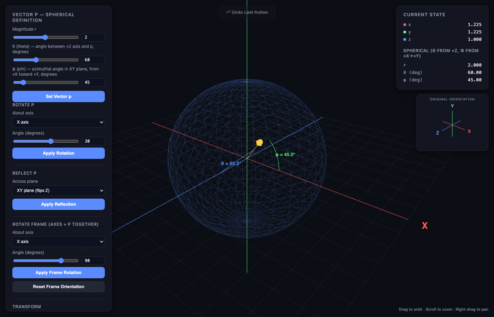

# Vector Lab

A single-file 3D tool for building intuition about spherical coordinates, rotations, and reflections. Define a vector by (r, θ, φ), transform it, and watch the angles update in real time in an actual 3D scene. No build step, no dependencies beyond Three.js loaded from a CDN.



## Try it

Just open `index.html` in a browser, it's fully self-contained. If GitHub Pages is enabled for this repo (Settings → Pages → Deploy from branch → `main` / root), it'll also be live at:

```
https://<your-username>.github.io/<repo-name>/
```

## What it does

- Define a vector by magnitude `r`, polar angle `θ` (measured from +Z), and azimuthal angle `φ` (in the XY-plane, from +X toward +Y) — the usual physics convention.
- Rotate the vector about X, Y, Z, or a custom axis and watch θ/φ recompute live.
- Reflect the vector across the XY, YZ, XZ, or a custom plane.
- Rotate the whole reference frame (axes + vector) about its current axes, not the original ones, so repeated rotations behave the way you'd expect.
- Once the frame is rotated, the original X/Y/Z axes stay as dashed reference lines while the new axes (solid, X′/Y′/Z′) show where things ended up.
- A small inset gizmo always shows the original orientation, so you don't lose track of where you started.
- Angle arcs drawn directly on the vector for θ and φ.
- Undo for the last action.
- Scale, normalize, negate helpers.
- Orbit camera: drag to rotate, scroll to zoom, right-drag to pan.

## Why this exists

Rotating a vector about some arbitrary axis doesn't change θ and φ by simple amounts unless that axis happens to be the polar axis. The coupling between θ and φ under rotations about X or Y comes straight out of spherical trig, and it's easy to get wrong by hand. This tool lets you just watch it happen instead of computing it and hoping you didn't make a sign error.

## Built with

Plain HTML/CSS/JS and [Three.js](https://threejs.org/) (r134, via jsDelivr). No framework, no package manager.

## Usage

1. Set r, θ, φ under "Vector p" and click "Set Vector p".
2. Use "Rotate p" / "Reflect p" to transform the vector against the fixed axes.
3. Use "Rotate Frame" to rotate the axes and vector together — watch the gizmo and the dashed original axes for reference.
4. "Undo Last Action" steps back one operation at a time.

## License

MIT, see [LICENSE](LICENSE).
